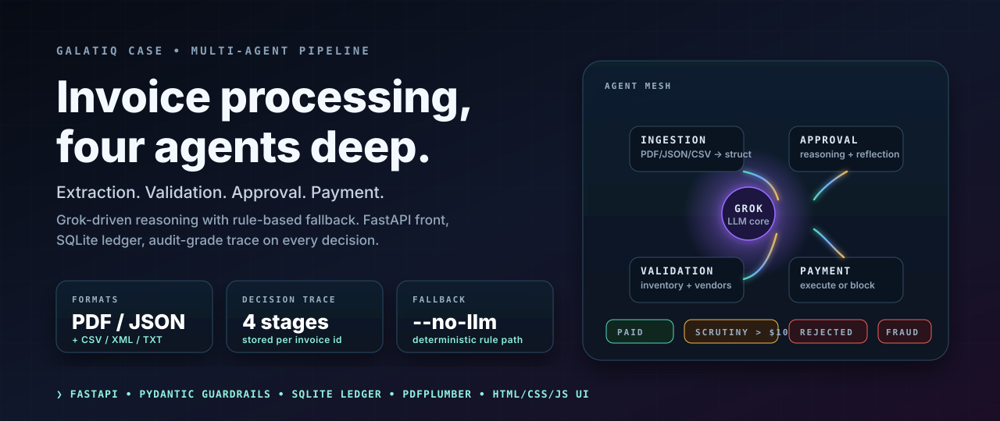
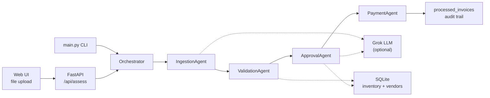

<p align="center">
  
</p>

<h1 align="center">Galatiq Invoice Processing</h1>

<p align="center">
  <strong>A four-agent invoice pipeline &#8212; extraction, validation, approval, payment &#8212; with Grok reasoning and a deterministic fallback.</strong>
</p>

<p align="center">
  
  
  
  
  
</p>

<p align="center">
  <a href="#quick-start">Quick start</a> /
  <a href="#what-it-does">What it does</a> /
  <a href="#architecture">Architecture</a> /
  <a href="#workflow-demo">Demos</a> /
  <a href="#sample-invoices">Samples</a> /
  <a href="#configuration">Config</a>
</p>

## Quick Start

```bash
git clone https://github.com/mhdk1602/galatiq-invoice-processing.git
cd galatiq-invoice-processing
pip install -r requirements.txt
cp .env.example .env             # add XAI_API_KEY
python main.py --init-db         # seeds inventory.db
python web_app.py                # http://localhost:8080
```

The CLI path runs the same pipeline:

```bash
python main.py --invoice_path=data/invoices/invoice_1001.txt           # LLM + rules
python main.py --invoice_path=data/invoices/invoice_1001.txt --no-llm  # rules only
```

## What it does

Acme Corp loses ~`$2M / year` on manual invoice processing: PDFs arrive in messy formats, get hand-keyed against a legacy inventory database, then chase email approvals before payment. Error rate ~30%, processing delay ~5 days.

This system replaces that pipeline with four agents and an LLM core. Every decision is traced, every stage is overridable, and the entire flow falls back to deterministic rules when the LLM is disabled.

| Stage | Agent | Job | Failure mode it catches |
|---|---|---|---|
| 1. Ingestion | `IngestionAgent` | Extract structured fields from PDF / TXT / JSON / CSV / XML | malformed files, missing identifiers, fraud keywords in raw text |
| 2. Validation | `ValidationAgent` | Cross-check items, quantities, and vendors against inventory + vendor tables | unknown SKUs, insufficient stock, blocked vendors, negative quantities |
| 3. Approval | `ApprovalAgent` | Apply business rules and (if enabled) Grok reasoning with reflection | high-value invoices crossing the scrutiny threshold, low LLM confidence |
| 4. Payment | `PaymentAgent` | Execute payment, log audit trail, or block | rejection, transient API failures, duplicate transaction IDs |

## Architecture



- **LLM is optional.** Toggle `use_llm=false` (UI checkbox) or `--no-llm` (CLI). The pipeline degrades to deterministic rules; the agent interface does not change.
- **Reflection** in the approval agent uses a second Grok call to challenge the first reasoning trace before producing a final verdict on high-value invoices.
- **SQLite** keeps the demo single-file. Swap the `database.py` adapter to point at Postgres or any DB-API target.

## Workflow demo

Four canonical paths through the pipeline:

| Scenario | Sample file | What the agents see | Outcome |
|---|---|---|---|
| Valid order, stock available | `invoice_1001.txt` | Widgets Inc., 2 line items, $5,000 | `PAID` with txn id |
| Quantity exceeds stock | `invoice_1002.txt` | Gadgets Co., requests 20x GadgetX, only 5 on hand | `REJECTED` at validation |
| Fraud signal | `invoice_1003.txt` | References zero-stock FakeItem; suspicious vendor | `REJECTED` with `FRAUD_DETECTED` |
| Unknown SKUs | `invoice_1008.txt` | SuperGizmo, MegaSprocket &#8212; not in DB | `REJECTED` at validation |

Each path is reproducible with `python main.py --invoice_path=data/invoices/<file>`.

## API endpoints

| Method | Endpoint | Purpose |
|---|---|---|
| `GET` | `/` | Web UI (upload, drag-and-drop, sample picker) |
| `POST` | `/api/assess` | Upload and process a single invoice |
| `GET` | `/api/sample-invoices` | List bundled samples |
| `POST` | `/api/assess-sample/{filename}` | Process a bundled sample (supports `?use_llm=false`) |
| `GET` | `/api/health` | Liveness probe |

```bash
curl -X POST -F "file=@invoice.pdf" http://localhost:8080/api/assess
curl -X POST "http://localhost:8080/api/assess-sample/invoice_1001.txt?use_llm=false"
```

## Sample invoices

All under `data/invoices/`:

| Invoice | Format | Designed to trigger | Expected outcome |
|---|---|---|---|
| `invoice_1001.txt` | TXT | normal happy path | `PAID` |
| `invoice_1002.txt` | TXT | quantity > stock | `REJECTED` |
| `invoice_1003.txt` | TXT | fraud keywords + zero-stock item | `REJECTED` |
| `invoice_1004.json` | JSON | clean JSON format | `PAID` |
| `invoice_1005.json` | JSON | high-value ($15K+) | `SCRUTINY` |
| `invoice_1006.csv` | CSV | CSV ingestion | `PAID` |
| `invoice_1008.txt` | TXT | unknown SKUs | `REJECTED` |
| `invoice_1009.json` | JSON | negative quantity | `REJECTED` |
| `invoice_1011.pdf` | PDF | PDF extraction path | varies by content |

## Configuration

Environment variables (`.env`):

| Variable | Default | Purpose |
|---|---|---|
| `XAI_API_KEY` | required | xAI Grok credential |
| `XAI_MODEL` | `grok-4-1-fast-reasoning` | model id |
| `PORT` | `8080` | FastAPI port |

Business rules (`src/config.py`):

| Setting | Default | Effect |
|---|---|---|
| `HIGH_VALUE_THRESHOLD` | `$10,000` | trigger extra scrutiny path |
| `MAX_INVOICE_AMOUNT` | `$500,000` | hard reject above this |
| `MIN_CONFIDENCE_THRESHOLD` | `0.6` | reject if LLM self-reported confidence is below |
| `BLOCKED_VENDORS` | list | auto-reject |
| `FRAUD_KEYWORDS` | list | trigger fraud path on ingestion |

## Stack

- **LLM** &#8212; xAI Grok via `xai-sdk`, optional and gated per call.
- **Backend** &#8212; FastAPI + Uvicorn, single-file orchestrator.
- **Database** &#8212; SQLite (`inventory.db`), seeded by `--init-db`.
- **PDF parsing** &#8212; `pdfplumber`.
- **Frontend** &#8212; vanilla HTML / CSS / JS under `templates/`.

## License

MIT &#8212; see [`LICENSE`](LICENSE).
